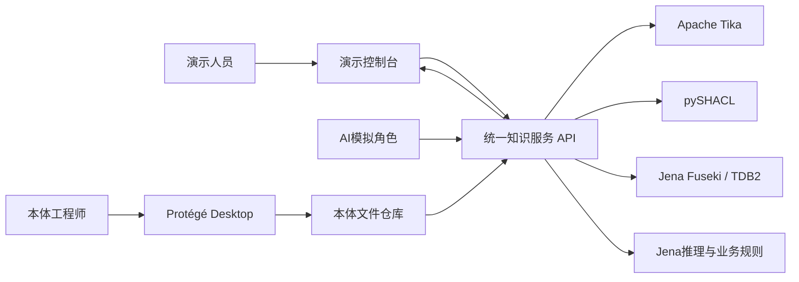
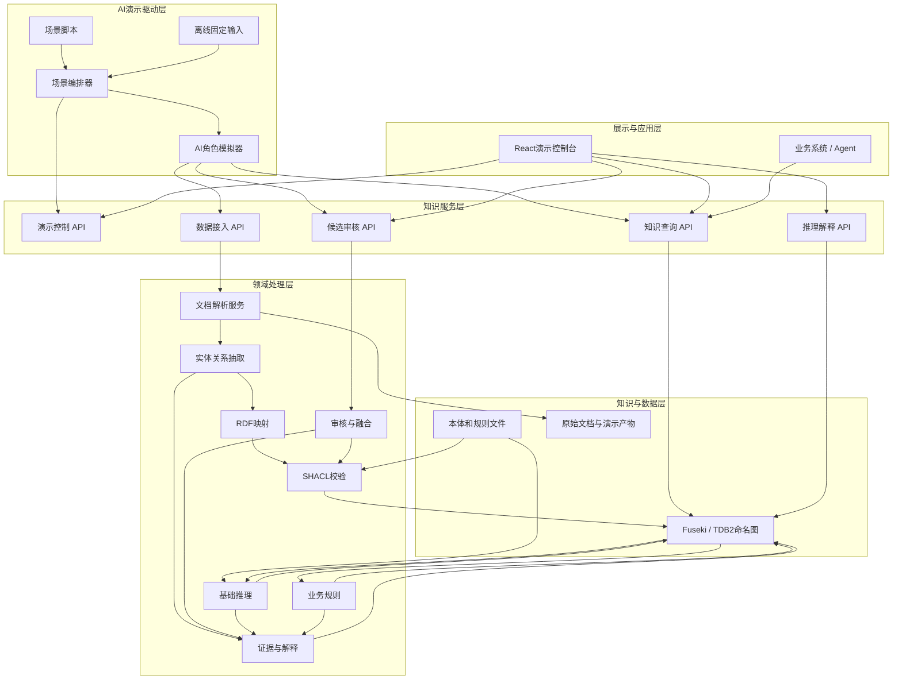
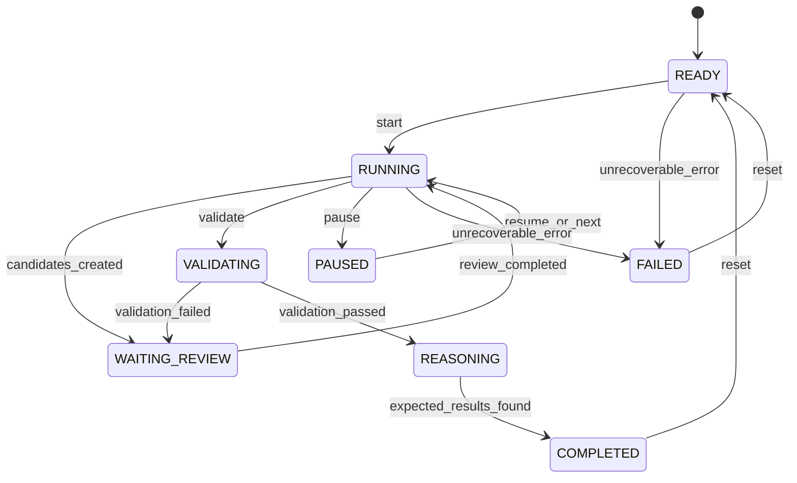
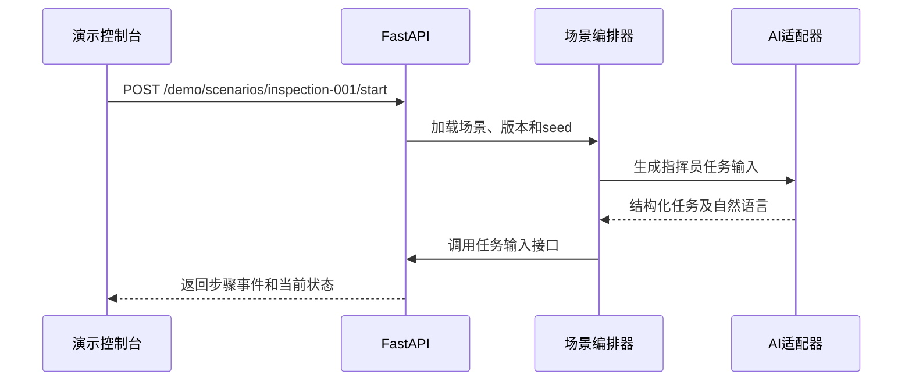
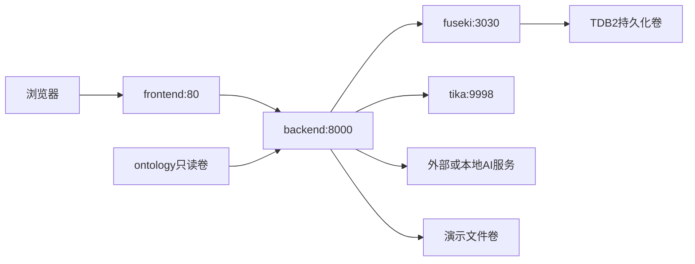

# 无人机线路巡检本体系统演示——架构设计

## 1. 文档目的

本文定义演示系统的整体架构、模块边界、数据流、接口关系和部署方式，作为后续编码、联调和验收的统一依据。

本系统面向“无人机电力线路热缺陷巡检”场景，重点证明以下能力：

- AI能够模拟任务、台账、感知事件、专家审核和业务查询等全部上游输入；
- 本体能够统一概念、属性、关系、约束和规则；
- 开源组件能够真实完成解析、校验、存储、推理和查询；
- 业务结论能够追溯到事实、规则、本体版本和原始证据。

## 2. 架构原则

1. **AI模拟输入，系统真实处理**：AI不得直接生成最终推理结果或写入正式知识图。
2. **本体文件是设计源**：Git中的OWL/TTL、SHACL和规则文件是唯一正式设计来源。
3. **候选知识与正式知识隔离**：自动抽取结果必须经过校验和审核才能进入正式事实图。
4. **原始事实与推理事实隔离**：推理结果可删除、重算，不污染人工确认的原始事实。
5. **所有结论可解释**：结论必须关联来源、审核记录、触发规则和推理批次。
6. **外部系统只调用业务API**：不直接暴露Fuseki写接口和任意SPARQL更新能力。
7. **演示可重复**：相同场景版本和随机种子必须得到一致的核心结果。
8. **AI可替换、可离线**：AI模型通过适配器接入，模型不可用时使用固定模拟数据。

## 3. 系统上下文



### 3.1 主要参与者

| 参与者 | 职责 |
| --- | --- |
| 演示人员 | 选择场景、启动演示、单步执行、查看结果和重置环境 |
| AI模拟指挥员 | 生成巡检任务和业务目标 |
| AI模拟数据源 | 生成装备台账、载荷说明、天气、遥测和异常事件 |
| AI模拟专家 | 对候选知识执行接受、修改、驳回、合并和消歧 |
| AI模拟业务用户 | 发起实体查询、任务匹配和解释请求 |
| 本体工程师 | 使用Protégé维护领域本体、约束和基础公理 |
| 业务系统/Agent | 通过API调用查询、校验、推理和解释服务 |

## 4. 总体逻辑架构



## 5. 分层职责

### 5.1 AI演示驱动层

负责按照场景脚本模拟全部上游输入，不实现本体推理。

核心模块：

- `scenario_loader.py`：读取并校验场景YAML；
- `orchestrator.py`：维护演示状态机，控制自动和单步执行；
- `roles/commander.py`：模拟指挥员任务输入；
- `roles/data_source.py`：模拟台账、文档、天气和实时事件；
- `roles/reviewer.py`：模拟专家审核操作；
- `roles/business_user.py`：模拟业务查询和解释请求；
- `fixtures/`：AI不可用时提供确定性输入。

### 5.2 展示与应用层

React前端提供以下页面：

1. 演示控制台：场景选择、自动/单步、暂停和重置；
2. 本体总览：类、属性、关系、规则和版本；
3. 数据接入：原始输入、解析结果和抽取结果；
4. 候选审核：接受、修改、驳回、合并和证据查看；
5. 校验推理：SHACL问题、推理前后差异和规则路径；
6. 图谱查询：实体详情、关系网络和业务查询；
7. 结论解释：来源、事实、规则、本体版本和推理批次。

### 5.3 知识服务层

FastAPI作为系统唯一对外入口，负责：

- 参数校验和数据契约；
- 演示状态控制；
- 服务编排和事务边界；
- 调用Tika、AI模型、pySHACL和Fuseki；
- 将SPARQL结果转换为稳定的业务JSON；
- 统一错误码、日志和调用链标识；
- 限制外部系统对图谱的直接写入。

### 5.4 领域处理层

| 模块 | 输入 | 输出 | 主要实现 |
| --- | --- | --- | --- |
| 文档解析 | PDF、Word、Excel、文本 | 文本、段落、表格、元数据 | Apache Tika，OCR可选 |
| 实体关系抽取 | 解析文本、本体词表 | 候选实体、属性、关系、置信度 | AI＋规则，自研编排 |
| RDF映射 | 候选知识JSON | RDF三元组和证据对象 | RDFLib |
| SHACL校验 | 候选或正式数据、本体约束 | 标准验证报告 | pySHACL |
| 审核与融合 | 候选知识、证据、审核动作 | 已确认事实、冲突记录 | 自研 |
| 基础推理 | 本体、正式事实 | 隐含类型和关系 | Jena推理 |
| 业务规则 | 事实、阈值、任务规则 | 候选装备、异常等级、建议 | Jena规则/SPARQL CONSTRUCT |
| 证据解释 | 全流程事件 | 来源链和推理解释 | PROV-O思想＋自研模型 |

### 5.5 知识与数据层

- Git仓库保存本体设计文件和版本；
- Fuseki/TDB2保存运行时知识；
- 本地卷保存上传文件、解析产物和演示日志；
- 第一版不引入独立对象存储和消息队列。

## 6. 本体设计与运行边界

### 6.1 建模期

```text
Protégé编辑 inspection.ttl
→ HermiT检查逻辑一致性
→ pySHACL检查示例数据
→ 推理回归测试
→ Git提交和版本标记
→ 发布到运行环境
```

建模期重点检查：

- 类层次是否合理；
- 类之间是否存在互斥冲突；
- 对象属性定义域和值域是否正确；
- 属性链是否产生预期结果；
- 示例数据是否满足SHACL约束；
- 新版本是否破坏既有推理结果。

### 6.2 运行期

运行期不直接调用Protégé，系统加载已发布文件：

- `ontology/inspection.ttl`：领域概念、关系和OWL公理；
- `ontology/shapes.ttl`：数据约束；
- `ontology/rules/inspection.rules`：业务规则；
- `ontology/tests/expected-inferences.ttl`：回归预期结果。

运行期使用Jena进行可服务化推理；HermiT主要用于建模期完整性检查。复杂OWL DL推理服务不纳入第一版。

## 7. 核心领域模型

### 7.1 第一版核心类

```text
Platform
└─ UAV
Payload
Capability
Mission
Asset
├─ PowerLine
└─ Tower
Observation
AnomalyEvent
Evidence
Organization
```

### 7.2 第一版核心关系

```text
UAV --carries--> Payload
Payload --providesCapability--> Capability
UAV --hasCapability--> Capability
Mission --requiresCapability--> Capability
UAV --candidateFor--> Mission
UAV --executes--> Mission
Mission --targetsAsset--> Asset
Observation --observedBy--> Payload
AnomalyEvent --nearAsset--> Asset
AnomalyEvent --hasEvidence--> Evidence
```

### 7.3 第一版典型推理

```text
carries ○ providesCapability → hasCapability

Mission requiresCapability Capability
UAV hasCapability Capability
UAV status Ready
UAV batteryLevel >= requiredBattery
→ UAV candidateFor Mission

AnomalyEvent temperature >= 75
AnomalyEvent confidence >= 0.80
→ AnomalyEvent rdf:type HighRiskThermalAnomaly
```

第一条适合使用OWL属性链；涉及数值比较和多条件判断的后两条使用业务规则，不强行建模为OWL DL公理。

## 8. 命名图设计

| 命名图 | 可写方 | 内容 | 清理策略 |
| --- | --- | --- | --- |
| `urn:graph:ontology` | 本体发布服务 | 正式OWL/RDFS本体 | 新版本发布时替换 |
| `urn:graph:shapes` | 本体发布服务 | SHACL约束 | 与本体版本同步替换 |
| `urn:graph:candidate` | 抽取、审核服务 | 未审核候选知识 | 审核后归档或删除 |
| `urn:graph:asserted` | 审核服务 | 人工确认的原始事实 | 只能经审核变更 |
| `urn:graph:inferred` | 推理服务 | 自动推理结果 | 每次推理可重建 |
| `urn:graph:provenance` | 各领域服务 | 来源、置信度、审核和推理证据 | 随业务记录保留 |

业务查询默认读取：

```text
ontology ∪ asserted ∪ inferred
```

候选知识查询只读取`candidate`和对应的`provenance`，不会混入正式业务结果。

## 9. 证据与推理解释模型

第一版采用显式“断言记录”描述证据，不依赖特定RDF-star实现。

```text
Assertion
├─ subject
├─ predicate
├─ object/value
├─ sourceDocument
├─ sourceLocation
├─ confidence
├─ extractionRun
├─ reviewStatus
├─ reviewer
└─ ontologyVersion

InferenceRecord
├─ conclusion
├─ usedAssertion
├─ appliedRule
├─ reasoningRun
├─ generatedAt
└─ ontologyVersion
```

解释服务返回示例：

```json
{
  "conclusion": "UAV-001 candidateFor Task-042",
  "type": "INFERRED",
  "rule": "equipment-capability-match-v1",
  "premises": [
    "Task-042 requiresCapability ThermalImaging",
    "UAV-001 hasCapability ThermalImaging",
    "UAV-001 status Ready",
    "UAV-001 batteryLevel 72"
  ],
  "ontologyVersion": "inspection-1.0.0",
  "sources": ["equipment-ledger-001", "mission-order-042"]
}
```

## 10. AI模拟架构

### 10.1 统一AI适配器

领域代码只依赖统一接口：

```text
generate_structured(role, instruction, schema, context, seed)
```

适配器负责：

- 调用配置的大模型；
- 强制结构化JSON输出；
- 使用JSON Schema/Pydantic校验；
- 超时、重试和错误转换；
- 记录模型、提示模板版本和调用标识；
- 失败时切换到固定模拟输入。

### 10.2 场景脚本

```yaml
scenario:
  id: inspection-001
  version: 1.0.0
  seed: 20260715

steps:
  - id: create-mission
    role: commander
    action: submit_mission
  - id: submit-equipment
    role: data_source
    action: submit_equipment_ledger
  - id: review-candidates
    role: reviewer
    action: review_candidates
  - id: run-validation
    system: pyshacl
    action: validate
  - id: run-reasoning
    system: jena
    action: infer
  - id: ask-why
    role: business_user
    action: ask_explanation

expected:
  - "UAV-001 hasCapability ThermalImaging"
  - "UAV-001 candidateFor Task-042"
  - "Hotspot-001 type HighRiskThermalAnomaly"
```

### 10.3 演示状态机



### 10.4 可信演示约束

- AI输出必须带`sourceType=AI_SIMULATION`；
- 相同`scenarioId + version + seed + stepId`作为幂等键；
- AI只能调用公开业务API，不能连接Fuseki更新端点；
- 预期结论由测试代码查询图谱验证，不能由AI宣布成功；
- 关键业务值由场景骨架约束，AI只生成表达和允许的变体；
- 界面明确标识模拟数据，防止与真实业务数据混淆。

## 11. 端到端数据流

### 11.1 场景启动



### 11.2 文档解析和知识抽取

```text
AI模拟文档
→ 保存原始文件和来源元数据
→ Tika提取文本、表格和元数据
→ AI按本体词表抽取候选知识
→ Pydantic校验抽取JSON
→ RDFLib生成候选三元组
→ 写入candidate图
→ 证据写入provenance图
```

### 11.3 审核、校验和入库

```text
AI模拟专家读取候选知识和证据
→ 调用审核API
→ 接受/修改/驳回/合并
→ pySHACL验证审核后数据
→ 验证失败：返回问题并重新审核
→ 验证通过：写入asserted图
→ 更新审核和来源记录
```

### 11.4 推理

```text
读取ontology + asserted
→ 执行OWL/RDFS基础推理
→ 执行业务规则
→ 生成新事实差异集
→ 原子替换inferred图
→ 写入InferenceRecord和推理批次
→ 运行预期结论检查
```

### 11.5 查询和解释

```text
AI模拟用户提出问题
→ 后端识别业务查询类型
→ 使用预定义SPARQL模板查询
→ 合并显式事实和推理事实
→ 查询provenance获得来源和规则
→ 返回结构化结果
→ AI可将结构化结果转成自然语言说明
```

AI只能润色结构化结果，不得补充图谱中不存在的事实。

## 12. API边界

### 12.1 演示控制

| 方法 | 路径 | 说明 |
| --- | --- | --- |
| POST | `/api/demo/scenarios/{id}/start` | 启动指定场景 |
| POST | `/api/demo/next` | 单步执行 |
| POST | `/api/demo/pause` | 暂停自动执行 |
| POST | `/api/demo/reset` | 清理场景数据并恢复初始状态 |
| GET | `/api/demo/state` | 查询当前状态和步骤 |
| GET | `/api/demo/events` | 查询完整演示事件流 |

### 12.2 知识生产

| 方法 | 路径 | 说明 |
| --- | --- | --- |
| POST | `/api/documents/parse` | 上传并解析文档 |
| POST | `/api/knowledge/extract` | 从解析结果抽取候选知识 |
| GET | `/api/candidates` | 查询待审核候选知识 |
| POST | `/api/candidates/{id}/decision` | 提交审核决定 |
| POST | `/api/knowledge/validate` | 执行SHACL校验 |
| POST | `/api/knowledge/publish` | 将审核通过数据写入正式图 |

### 12.3 推理和查询

| 方法 | 路径 | 说明 |
| --- | --- | --- |
| POST | `/api/reasoning/run` | 执行基础推理和业务规则 |
| GET | `/api/reasoning/runs/{id}` | 查询推理批次 |
| GET | `/api/reasoning/{id}/explanation` | 查询结论解释 |
| GET | `/api/entities/{id}` | 查询实体详情 |
| GET | `/api/entities/{id}/relations` | 查询实体关系 |
| GET | `/api/tasks/{id}/candidates` | 查询任务候选无人机 |
| GET | `/api/anomalies/{id}` | 查询异常及风险判断 |

## 13. 部署架构



第一版Docker Compose服务：

| 服务 | 是否必须 | 说明 |
| --- | --- | --- |
| `frontend` | 是 | 演示控制台和图谱展示 |
| `backend` | 是 | API、编排和领域服务 |
| `fuseki` | 是 | RDF存储和SPARQL服务 |
| `tika` | 是 | 文档解析服务 |
| `ocr` | 否 | 仅扫描件场景启用 |

部署约束：

- 仅`frontend`和`backend`对宿主机暴露端口；
- Fuseki更新端点仅容器内可访问；
- 本体目录以只读卷挂载给后端；
- TDB2和演示文件使用独立持久化卷；
- `demo reset`只清理当前`scenarioId`对应的数据。

## 14. 配置与密钥

`.env`至少包含：

```text
APP_ENV=demo
AI_ENABLED=true
AI_PROVIDER=compatible
AI_MODEL=example-model
AI_API_BASE=
AI_API_KEY=
FUSEKI_URL=http://fuseki:3030/ontology
TIKA_URL=http://tika:9998
SCENARIO_ID=inspection-001
SCENARIO_SEED=20260715
ONTOLOGY_VERSION=inspection-1.0.0
```

要求：

- `.env`不提交版本库；
- `.env.example`不包含真实密钥；
- 日志不得打印模型密钥和完整敏感请求头；
- AI关闭时自动使用fixture，不影响演示主流程。

## 15. 可靠性设计

### 15.1 幂等性

- 每个场景步骤使用固定幂等键；
- 重复提交不会生成重复实体和关系；
- 实体IRI由`namespace + entityType + stableId`生成；
- 推理批次按输入图版本和规则版本去重。

### 15.2 失败处理

| 失败点 | 处理方式 |
| --- | --- |
| AI超时或格式错误 | 重试一次，随后切换fixture |
| Tika解析失败 | 标记步骤失败，保留文件和错误信息 |
| 抽取结果不符合Schema | 不生成RDF，返回结构化问题 |
| SHACL校验失败 | 保留候选状态，进入重新审核 |
| Fuseki写入失败 | 不更新审核完成状态，可安全重试 |
| 推理失败 | 保留asserted图，不替换旧inferred图 |
| 预期结论缺失 | 场景标记失败并展示缺失项 |

### 15.3 重置策略

重置按场景标识删除：

- 候选知识；
- 当前场景正式事实；
- 当前场景推理结果；
- 当前场景证据和演示事件。

本体、SHACL和规则版本不随普通场景重置删除。

## 16. 安全边界

第一版虽然是演示系统，仍需满足：

- 外部不能直接访问Fuseki写端点；
- 后端使用SPARQL模板和参数绑定，避免拼接任意查询；
- 上传文件限制类型、大小和数量；
- 模拟数据明确标记，不与真实数据混用；
- 审核和发布接口保留角色字段及审计记录；
- AI输入视为不可信数据，必须经过Schema和本体约束校验；
- 自然语言查询不能转换为不受限SPARQL UPDATE。

## 17. 可观测性

所有请求和演示步骤统一记录：

```text
traceId
scenarioId
scenarioVersion
stepId
actorRole
component
inputReference
outputReference
status
startedAt
finishedAt
errorCode
```

控制台应能按时间轴展示：

```text
AI输入 → Tika解析 → AI抽取 → RDF映射 → 审核
→ SHACL校验 → Fuseki入库 → Jena推理 → API查询
```

第一版采用结构化日志和数据库/图谱中的演示事件记录，不引入完整监控平台。

## 18. 代码模块映射

| 架构模块 | 规划路径 |
| --- | --- |
| 场景编排 | `simulator/orchestrator.py` |
| 场景加载 | `simulator/scenario_loader.py` |
| AI角色 | `simulator/roles/` |
| 演示API | `backend/app/api/demo.py` |
| 文档接入API | `backend/app/api/documents.py` |
| 候选审核API | `backend/app/api/candidates.py` |
| 知识查询API | `backend/app/api/knowledge.py` |
| 文档解析服务 | `backend/app/services/ingestion_service.py` |
| 知识抽取服务 | `backend/app/services/extraction_service.py` |
| RDF映射服务 | `backend/app/services/rdf_mapping_service.py` |
| SHACL校验服务 | `backend/app/services/validation_service.py` |
| 推理服务 | `backend/app/services/reasoning_service.py` |
| 证据解释服务 | `backend/app/services/provenance_service.py` |
| Fuseki适配器 | `backend/app/adapters/fuseki.py` |
| Tika适配器 | `backend/app/adapters/tika.py` |
| AI适配器 | `backend/app/adapters/ai.py` |
| 本体文件 | `ontology/inspection.ttl` |
| SHACL约束 | `ontology/shapes.ttl` |
| 业务规则 | `ontology/rules/inspection.rules` |
| 场景脚本 | `scenarios/inspection-001.yaml` |
| 演示前端 | `frontend/src/` |

## 19. 测试策略

### 19.1 本体测试

- OWL文件可以被Protégé和RDFLib正常读取；
- 本体不存在不一致和不可满足类；
- SHACL正确样例通过、错误样例失败；
- 属性链和业务规则产生预期三元组；
- 本体升级后运行推理回归测试。

### 19.2 后端测试

- 数据契约和错误码单元测试；
- AI输出Schema校验测试；
- RDF映射和稳定IRI测试；
- Fuseki、Tika适配器集成测试；
- 审核、入库和推理幂等测试；
- 证据链完整性测试。

### 19.3 端到端测试

```text
重置环境
→ 启动inspection-001
→ 执行全部步骤
→ 验证一次SHACL失败和修正
→ 验证候选无人机结论
→ 验证高风险热异常结论
→ 验证每个结论都有来源和规则
```

AI关闭和AI开启两种模式都必须通过同一组核心断言。

## 20. 实施顺序

### 阶段一：知识底座闭环

1. 创建巡检本体、SHACL和示例数据；
2. 部署Fuseki/TDB2；
3. 实现RDFLib映射、pySHACL校验和Jena推理；
4. 用固定数据完成“入库—推理—查询—解释”。

### 阶段二：AI模拟闭环

1. 实现场景脚本和状态机；
2. 实现统一AI适配器和fixture降级；
3. 模拟指挥员、数据源、专家和业务用户；
4. 实现单步、自动、暂停和重置。

### 阶段三：文档抽取与展示

1. 接入Tika；
2. 实现实体关系抽取和候选审核；
3. 实现React演示控制台和Cytoscape.js图谱视图；
4. 完成五分钟演示脚本。

### 阶段四：集成验收

1. Docker Compose一键启动；
2. AI开启和关闭模式回归；
3. 演示失败恢复和重复执行；
4. 验收查询结果、推理结论和证据链。

## 21. 关键架构决策

| 决策 | 结论 | 原因 |
| --- | --- | --- |
| 是否自研本体编辑器 | 否 | 第一版直接使用Protégé，集中建设领域本体和业务服务 |
| 是否让AI直接写正式图 | 否 | 防止错误和不可追溯知识进入正式数据 |
| 是否让AI生成推理结论 | 否 | 推理必须由真实规则和引擎完成 |
| 是否直接暴露SPARQL | 仅内部 | 对外提供稳定、可控的业务API |
| 是否混存事实和推理结果 | 否 | 推理结果需要能够独立重算和回退 |
| 是否第一版部署HermiT服务 | 否 | 建模期通过Protégé使用，运行期优先采用Jena |
| 是否第一版引入消息队列 | 否 | REST编排足以支撑可重复演示 |
| 是否依赖在线AI才能运行 | 否 | fixture保证离线演示和自动测试 |

## 22. 完成定义

当以下条件全部满足时，架构闭环完成：

1. Docker Compose能够启动前端、后端、Fuseki和Tika；
2. `inspection-001`能够自动和单步运行；
3. 所有上游输入均可由AI角色模拟；
4. AI不可用时固定输入可以完成同样流程；
5. SHACL能够发现并展示至少一个数据问题；
6. 推理引擎能够产生候选无人机和异常等级结论；
7. 业务API能够查询显式事实和推理事实；
8. 每个核心结论均能展示事实、规则、来源和本体版本；
9. 重置后可重复运行，核心结果一致；
10. AI不能绕过审核、校验和推理直接生成正式知识。
